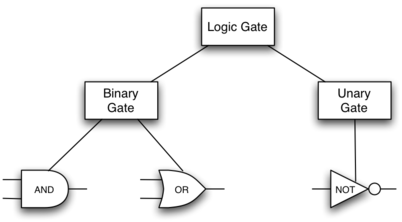

用python实现一个数字电路对象-[继承](http://interactivepython.org/runestone/static/pythonds/Introduction/ObjectOrientedProgramminginPythonDefiningClasses.html#inheritance-logic-gates-and-circuits)

# 1.13.2 继承-逻辑门和电路 

**继承**是python中两个对象间得一种关系。children继承parents的特性，children类被称为**子类**，parents被称为**超类**。

python中的集合数据类型就包含了继承的关系。


`list`,`tuple`和`string`是序列集合类型，`dictionary`是非序列集合类型，二者继承自不同的父类。

通过按照等级组织类的继承，面向对象的编程语言可以更好地适应新地场景，比如说可以清晰地整理对象间地关系。下面通过一个数字电路地模拟应用说明面向对象地编程应用。

数字电路中基本元件有**与门**、**或门**、**非门**三种，其电路行为可以用真值表表示出来：


通过多个基本元件地组合可以实现特定地功能电路：


我们可以构建一个类来表示逻辑门，各个逻辑门的层次继承关系如下：



首先构建基本逻辑门类：

```python
class LogicGate:

    def __init__(self,n):
        self.label = n
        self.output = None

    def getLabel(self):
        return self.label

    def getOutput(self):
        self.output = self.performGateLogic()
        return self.output
```

这里一个逻辑门首先需要有自己的标签，同时所有的逻辑门都会给出输出，但是这里并没有实现`performGateLogic()`函数，因为逻辑门的输入未知，之后实现各个逻辑门的时候需要记得实现该函数。

我们把基本逻辑门分为二元逻辑门`BinaryGate `和一元逻辑门`UnaryGate `，二元逻辑门有两个输入，一元逻辑门只有一个输入。

```python
# 二元逻辑门
class BinaryGate(LogicGate):

    def __init__(self,n):
        LogicGate.__init__(self,n)

        self.pinA = None
        self.pinB = None

    def getPinA(self):
        return int(input("Enter Pin A input for gate "+ self.getLabel()+"-->"))

    def getPinB(self):
        return int(input("Enter Pin B input for gate "+ self.getLabel()+"-->"))

# 一元逻辑门
class UnaryGate(LogicGate):

    def __init__(self,n):
        LogicGate.__init__(self,n)

        self.pin = None

    def getPin(self):
        return int(input("Enter Pin input for gate "+ self.getLabel()+"-->"))
```

两个子类的初始化中首先对父类属性进行初始化操作，然后初始化自身的属性。这里的父类是`LogicGate`，python中的`super`函数也可以用来替代明确地写出父类，比如`LogicGate.__init__(self,n) `可以换成`super(UnaryGate,self).__init__(n) `。逻辑门中加入了读取输入值地功能。

接下来实现的门具有特定的功能，比如与门是二元逻辑门中的一种：

```python
class AndGate(BinaryGate):

    def __init__(self,n):
        super(AndGate,self).__init__(n)

    def performGateLogic(self):

        a = self.getPinA()
        b = self.getPinB()
        if a==1 and b==1:
            return 1
        else:
            return 0
```

这里根据与门的真值表实现了`performGateLogic`方法，对于与门来说只有两个输入都为1，输出才为1. 可以先构建一个与门的实例，然后通过getOutput方法在指定输入后获得与门的输出：

```python
>>> g1 = AndGate("G1")
>>> g1.getOutput()
Enter Pin A input for gate G1-->1
Enter Pin B input for gate G1-->0
0
```

同样的方法可以实现或门和非门。

在实现几个基本逻辑门后，还需要一个连接器件将逻辑门连接起来才能构成新的门，这里实现一个`connector`类用于连接。connector类和LogicGate类之间没有继承关系，但是connector类中有LogicGate类的实例。


```python
class Connector:

    def __init__(self, fgate, tgate):
        self.fromgate = fgate
        self.togate = tgate

        tgate.setNextPin(self)

    def getFrom(self):
        return self.fromgate

    def getTo(self):
        return self.togate
```

在连接二元实例的时候，需要保证一个输入是唯一确定的，因此对于二元类需要加入一个方法`setNextPin()`在pinA已经连接的时候连接到PinB，如果都连接的话返回错误信息。

```python
def setNextPin(self,source):
    if self.pinA == None:
        self.pinA = source
    else:
        if self.pinB == None:
            self.pinB = source
        else:
           raise RuntimeError("Error: NO EMPTY PINS")
```

同时getPinX()的方法也应该考虑到输入是之前门输出的情况，修改为：

```python
def getPinA(self):
    if self.pinA == None:
        return input("Enter Pin A input for gate " + self.getLabel()+"-->")
    else:
        return self.pinA.getFrom().getOutput()
```

完整示例：

```python
class LogicGate:

    def __init__(self,n):
        self.name = n
        self.output = None

    def getLabel(self):
        return self.name

    def getOutput(self):
        self.output = self.performGateLogic()
        return self.output


class BinaryGate(LogicGate):

    def __init__(self,n):
        super(BinaryGate,self).__init__(n)

        self.pinA = None
        self.pinB = None

    def getPinA(self):
        if self.pinA == None:
            return int(input("Enter Pin A input for gate "+self.getLabel()+"-->"))
        else:
            return self.pinA.getFrom().getOutput()

    def getPinB(self):
        if self.pinB == None:
            return int(input("Enter Pin B input for gate "+self.getLabel()+"-->"))
        else:
            return self.pinB.getFrom().getOutput()

    def setNextPin(self,source):
        if self.pinA == None:
            self.pinA = source
        else:
            if self.pinB == None:
                self.pinB = source
            else:
                print("Cannot Connect: NO EMPTY PINS on this gate")


class AndGate(BinaryGate):

    def __init__(self,n):
        BinaryGate.__init__(self,n)

    def performGateLogic(self):

        a = self.getPinA()
        b = self.getPinB()
        if a==1 and b==1:
            return 1
        else:
            return 0

class OrGate(BinaryGate):

    def __init__(self,n):
        BinaryGate.__init__(self,n)

    def performGateLogic(self):

        a = self.getPinA()
        b = self.getPinB()
        if a ==1 or b==1:
            return 1
        else:
            return 0

class UnaryGate(LogicGate):

    def __init__(self,n):
        LogicGate.__init__(self,n)

        self.pin = None

    def getPin(self):
        if self.pin == None:
            return int(input("Enter Pin input for gate "+self.getLabel()+"-->"))
        else:
            return self.pin.getFrom().getOutput()

    def setNextPin(self,source):
        if self.pin == None:
            self.pin = source
        else:
            print("Cannot Connect: NO EMPTY PINS on this gate")


class NotGate(UnaryGate):

    def __init__(self,n):
        UnaryGate.__init__(self,n)

    def performGateLogic(self):
        if self.getPin():
            return 0
        else:
            return 1


class Connector:

    def __init__(self, fgate, tgate):
        self.fromgate = fgate
        self.togate = tgate

        tgate.setNextPin(self)

    def getFrom(self):
        return self.fromgate

    def getTo(self):
        return self.togate


def main():
   g1 = AndGate("G1")
   g2 = AndGate("G2")
   g3 = OrGate("G3")
   g4 = NotGate("G4")
   c1 = Connector(g1,g3)
   c2 = Connector(g2,g3)
   c3 = Connector(g3,g4)
   print(g4.getOutput())

main()

```


