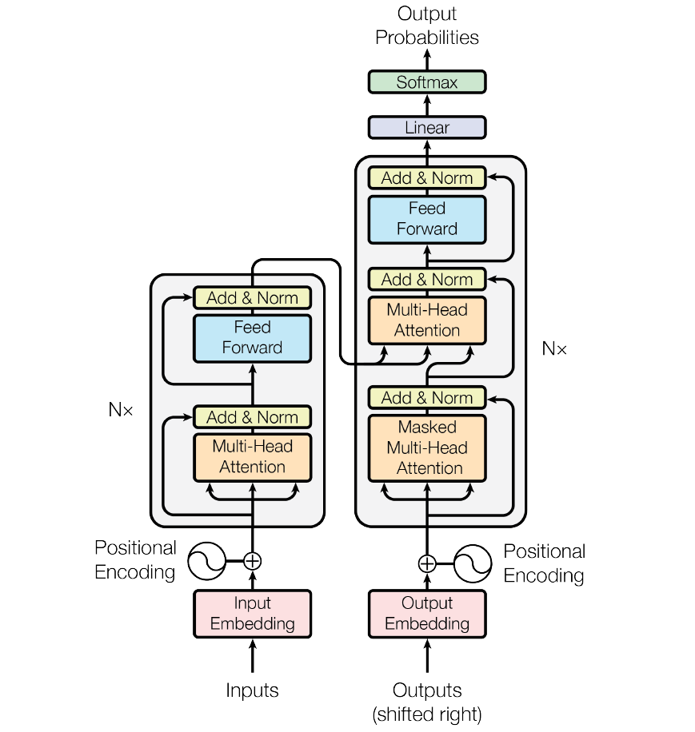
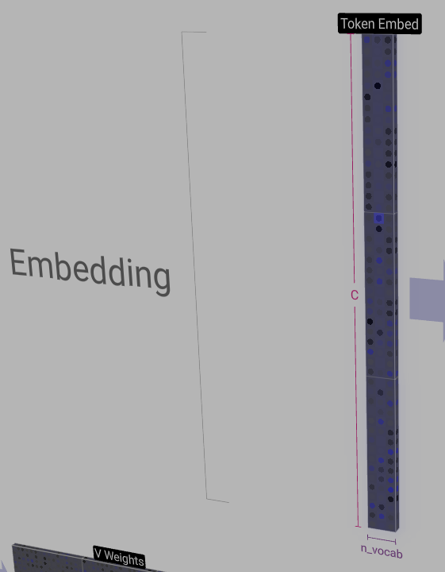
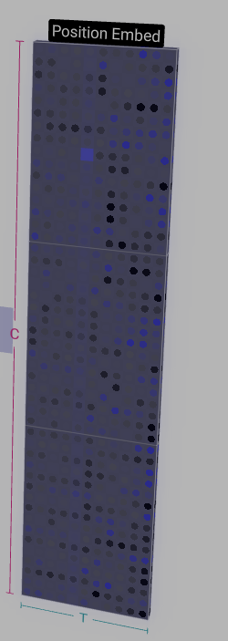
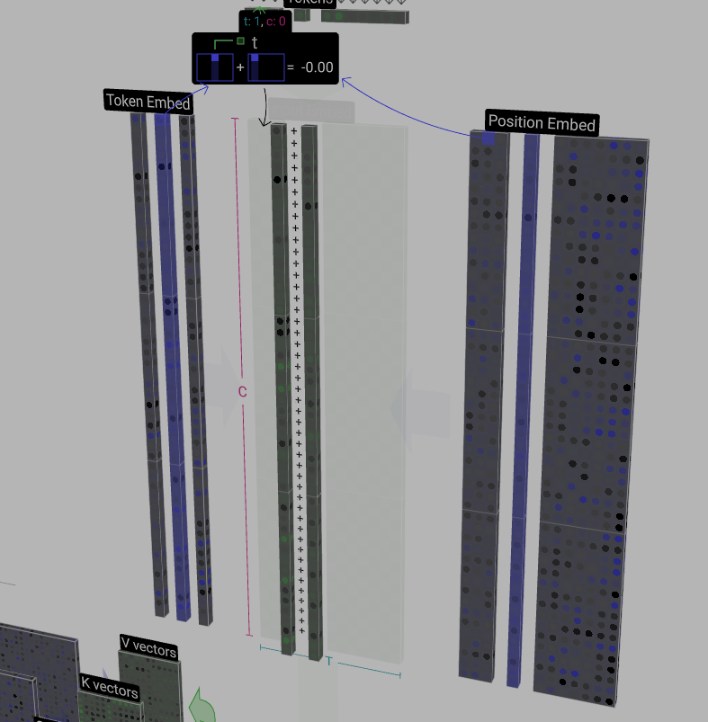
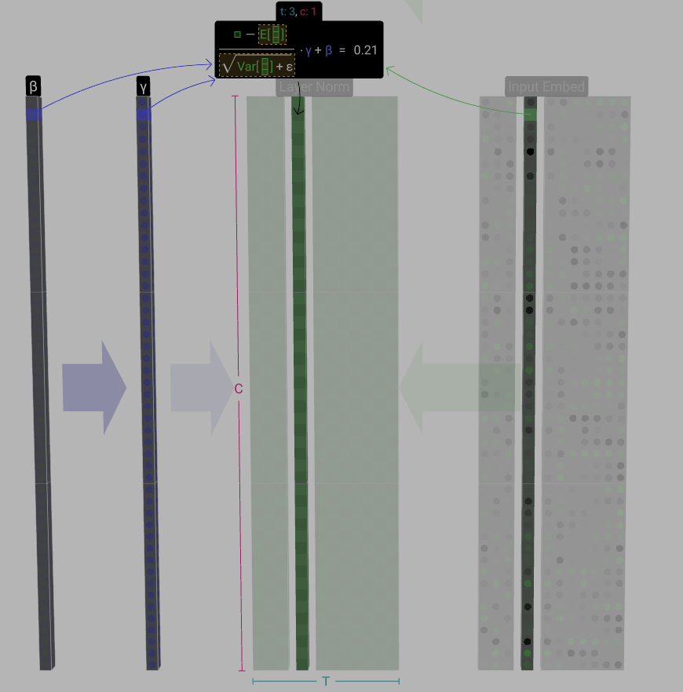
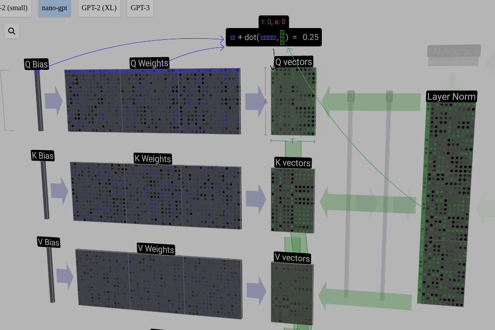
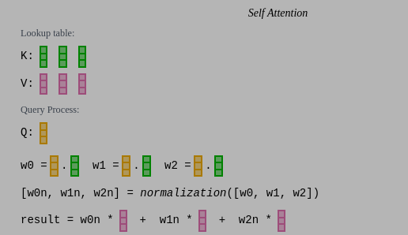
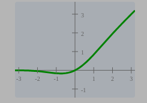
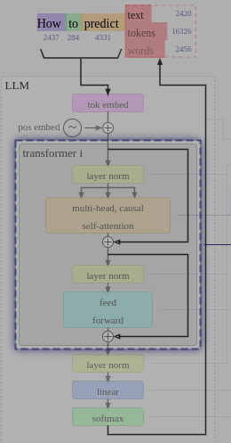
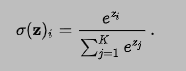

minGPT是一个用pytorch实现的结构简单的GPT模型，更加容易理解和学习：[GitHub - karpathy/minGPT: A minimal PyTorch re-implementation of the OpenAI GPT (Generative Pretrained Transformer) training](https://github.com/karpathy/minGPT)。

## GPT模型

minGPT项目中实现了多种GPT模型（包括GPT2的多个版本），其中结构最简单的是`nanoGPT`。

Transformer论文中，模型结构分为编码器和解码器（下图左侧为编码器，右侧为解码器）；编码器和解码器中有N个结构相似的Block，很多代码实现中称为GLMBlock；GLMBlock中核心结构是Multi-Head的SelfAttention机制。此外，Transformer模型并不一定要同时具有编码器和解码器，二者可以独立使用。GPT模型中主要使用解码器。




nanoGPT是一个结构非常简单的GPT模型，意味着它具备了GPT模型的所有要素，但是尽量简化了其中的参数。[该网站](https://bbycroft.net/llm)对nanoGPT模型做了非常详尽的可视化解释。

## nanoGPT - 字符排序

下文以minGPT仓库中的demo模型为例分析一个简单Transeformer模型的运算过程。该demo模型实现了简单的字符串排序，字符串输入范围为A-C，最大长度11。

这里以输入序列为：`CBABBC`进行分析。

gpt模型的参数如下：
```python
'gpt-nano':     dict(n_layer=3, n_head=3, n_embd=48)
```

#### Token映射

通过Map查找表，根据简单映射关系`A - 0, B - 1, C -2`，将Token映射为数字`210112`。


#### Embedding
Embedding过程是将输入的Token序列转换为特征矩阵的过程，包括token嵌入和位置编码嵌入，分别对应两个矩阵作为查找表：
* token embedding matrix：词嵌入矩阵，矩阵尺寸为 - 词汇表 x 特征维度(channel)
* position embedding matrix：位置编码矩阵，矩阵尺寸为 - 可接受最大输入长度 x 特征维度(channel)

在pytorch中实现使用`torch.nn.Embedding`实现：
```python
wte = nn.Embedding(config.vocab_size, config.n_embd)                                                                                                   
wpe = nn.Embedding(config.block_size, config.n_embd)
```

其中，词嵌入算子`wte`中`config.vocab_size`代表模型所能识别单词表的维度，在字符串排序的nanoGPT模型（下文简称demo模型）中，词表中只有A-C，对应参数为3（下图中矩阵维度n_vocab）；`config.n_embed`代表词嵌入矩阵的特征维度，在demo模型中u对应值为48（下图中矩阵维度C）。



位置编码算子`wpe`中`config.block_size`代表模型所能接收的最大输入长度，demo模型中对应值为`2 * input_len - 1 = 11`（下图中矩阵维度T）。



上述两个矩阵的值都是在训练过程中生成的，推理过程中作为权重使用。

Embedding层的计算过程就是根据输入token的index和位置，将两个矩阵中的对应列相加：在demo模型中t=3时刻输入token为B，对应Token Embed矩阵中第1列（下标从0开始），对应Position Embed矩阵中第3列（下标从0开始），两列相加作为词嵌入的结果`input embedding`，用于后续处理。




#### LayerNormal

归一化层（LayerNormal）是对矩阵中没一列进行单独的归一化处理，具体就是将一列数据构造为均值为0,标准差为1的向量，其目的是保证模型训练过程中的稳定性。

其在pytoch中实现使用`torch.nn.LayerNorm`：
```python
ln_f = nn.LayerNorm(config.n_embd)
```
其中主要参数是词嵌入矩阵的特征维度`config.n_embed`，demo模型中对应值为48。

 具体LayerNormalize过程如下图所示：
 

#### SelfAttention
注意力机制是Transformer模型的核心，GPT模型中一般有多个Head，下文主要关注单个Head的执行过程。

##### Q、K、V vector计算
注意力机制的第一步是根据NormalizedInputEmbedding生成三个向量：
* Q: Query vector
* K: Key vector
* V: Value vector

对应的python代码：
```python
## 初始化
# key, query, value projections for all heads, but in a batch
self.c_attn = nn.Linear(config.n_embd, 3 * config.n_embd)

## 推理
# calculate query, key, values for all heads in batch and move head forward to be the batch dim
q, k ,v  = self.c_attn(x).split(self.n_embd, dim=2) 
```

Q、K、V向量计算如下图所示：


- [x] @TODO: Q,K,V矩阵的列参数如何确定？

NormalizedInputEmbedding矩阵分别和Q、K、V对应的权重矩阵相乘，生成对应的Q，K，V向量。在Pytorch中Q、K、V权重矩阵被合并到了一个线性层（self.c_atten）;此外，MutiHead的权重也被合并在了一起。上图中仅表示一个Head的计算，因此，权重矩阵（Q、K、V Weights）中行维度（A）为词嵌入矩阵的特征C/nHead（demo模型中对应48 / 3 = 16）。对应的权重矩阵也是在训练过程中通过反向传播得到，在推理过程中直接使用。

##### 自注意力机制

SelfAttention的核心逻辑是让输入尽可能感知到之前的输入，其过程类似于查表：



1. 将t=N时刻的Q向量与所有之前时刻的K向量做点积（计算相似度），将计算结果存入AttentionMatrix的第N行中;
2. AttentionMatrix做SoftMax归一化处理;
3. 将AttentionMatrixNorm矩阵中第N行作为权重，计算Value Vector中各列的加权和，作为最终输出的第N列。

对应的python代码：
```python
# 初始化
# causal mask to ensure that attention is only applied to the left in the input sequence 
self.register_buffer("bias", torch.tril(torch.ones(config.block_size, config.block_size)).view(1, 1, config.block_size, config.block_size))

# 推理
# causal self-attention; Self-attend: (B, nh, T, hs) x (B, nh, hs, T) -> (B, nh, T, T)
att = (q @ k.transpose(-2, -1)) * (1.0 / math.sqrt(k.size(-1)))                                                                                         att = att.masked_fill(self.bias[:,:,:T,:T] == 0, float('-inf'))                                                                                         att = F.softmax(att, dim=-1)                                                                                                                             att = self.attn_dropout(att) 
y = att @ v # (B, nh, T, T) x (B, nh, T, hs) -> (B, nh, T, hs)
y = y.transpose(1, 2).contiguous().view(B, T, C) # re-assemble all head outputs side by side
```

代码实现中，attention矩阵初始化为一个下三角矩阵（`self.bias`），以保证attention计算时只保留到T时刻之前的结果。此外，代码中还加入了dropout层剪枝，避免过拟合。

最终MultiHead的输出结果堆叠起来，还原为原特征维度：nh x hs -> C (对应demo中为3 x 16 = 48)。

#### Projection
projection就是一个线性层，增加模型的映射能力，输入输出维度相同，都是Token的特征维度。

对应python代码：
```python
# output projection
y = self.resid_dropout(self.c_proj(y))
```

Projection之后使用了残差层将输入和输出连接。

#### MLP
MLP层就是经典的神经网络层，激活函数使用GELU。

```python
self.mlp = nn.ModuleDict(dict(
             c_fc    = nn.Linear(config.n_embd, 4 * config.n_embd),
             c_proj  = nn.Linear(4 * config.n_embd, config.n_embd),
             act     = NewGELU(),                         
             dropout = nn.Dropout(config.resid_pdrop)))

def GELU(self, x):
         return 0.5 * x * (1.0 + torch.tanh(math.sqrt(2.0 / math.pi) * (x + 0.044715 * torch.pow(x, 3.0))))
```

激活函数：


mlp层最后的输出也采用了残差连接的方式。

#### Transformer
以上内容构成了Transformer模型的单个Block层，通常多个Block层连接构成具备一定功能的模型。



#### Softmax

softmax实际上是对输入数据取指数，然后进行归一化，计算公式如下：


#### Output

最终输出是通过一个线性层，将输入从特征维度向量（C）映射回词表对应的维度（n_vocab），表示输出对应词汇的概率，选择概率最高的输出。

对应python代码：
```python
# 初始化
self.lm_head = nn.Linear(config.n_embd, config.vocab_size, bias=False)

# 推理
logits = self.lm_head(x)
```

